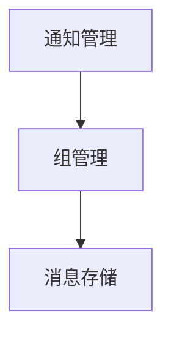

## 方案归纳

> 待更新

1. 稳定性方案
2. 文件系统方案
3. 性能方案
4. 功耗方案
5. 内存管理方案
6. ICT双核通信方案
7. 秒表高速周期方案
8. 闹钟管理
9. NFC多城市管理方案
10. 拍照助手方案
11. 通知-数据结构及方案
12. 世界时钟
13. 农历转化
14. 天气
15. NFC关机刷卡
16. 屏幕管理
17. 震动管理
18. LOG系统
19. LOG工具流程
20. 桌面框架


### 资源

1. 图片资源
2. 字库资源
3. 表盘资源


### 性能

1. 帧率：资源预加载
2. 消息响应：a消息去重 bTask优先级调整 c加入消息优先级
3. 触摸响应： 不在tick进行耗时操作。
4. 开机性能：psram初始完成后，即可开始对xip的搬迁，然后迅速进行UI TASK 的初始化。
5. 应用打开性能：图片预缓存。
6. 关机性能： 核心task的数据保存后掉电，如果超时，直接掉电。
7. 开机性能：主要是代码搬迁和资源加载耗费事件。

### 通知

1. 多级解耦

```c
首先上层是：通知管理， 用来进行增删查改的接口暴漏
中间是： 组管理系统： 拥有聚合功能
底层是：存储组件：对单一消息进行存储
```




1. 实现数据的：增删查改
    1. 增加： 收到消息
    2. 删除：删除单个消息，删除组消息
    3. 查： 查询单个消息，查询组消息
    4. 改： 回复消息

**内存池方案**


**屏幕管理**

1. 亮屏
2. 超时灭屏
3. 屏幕常亮
4. 强制灭屏


**功能设计：**

1. 创建定时器
2. 用户点击，滑动等操作屏幕的时候，重置计时器。
3. 超时灭屏
4. 强制灭屏


**接口：**

```c
1. 设置默认灭屏时间
2. 自定义灭屏时间
3. 持有屏幕常量锁
4. 屏幕亮度调整
```


### 存储方案

- psram方案

| 分区名字 | 大小  | 备注          |
| -------- | ----- | ------------- |
| code     | 4M    | xip占用一半   |
| Font     | 2M    | 动态字        |
| Img      | 8M    | 图片          |
| Dump     | 50k   | 机器的现场    |
| Log      | 50k   |               |
| Notify   | 2M    |               |
| Sport    | 50k   |               |
| Health   | 50k   |               |
| Sync     | 10k   |               |
| Ble      | 25k   | 协议收发各11k |
| ICT      | 16k   |               |
| 总共：   | 15.4M |               |
| total    | 16M   | 总空间大小    |
|          |       |               |

- flash方案

| 分区名字            | 大小      | 备注 |
| ------------------- | --------- | ---- |
| code                | 2M        |      |
| OTA                 | 30M       |      |
| FONT + IMG          | 50M       |      |
| LOG                 | 4m        |      |
| DUMP                | 50K       |      |
| 生产                | 256K      |      |
| NV                  | 32K       |      |
| User                | 2M        |      |
| NFC                 | 5M        |      |
| file system reserve | 1M        |      |
| bad block           | 6.4M (5%) |      |
| sensor log          | 1M        |      |
| bootloader log      | 4K        |      |
| all                 | 105M      |      |
| total:              | 128M      |      |

